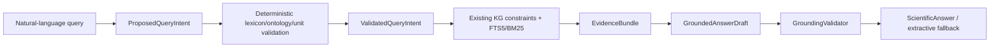

# Phase 3 architecture

Offline construction is unchanged: canonical NASA records, RDF, lexicon, registry, and FTS are the authority. Online processing is explicit and has no autonomous loop. The interpreter may propose wording mappings but cannot establish identity. The synthesizer receives only the `EvidenceBundle`; source text is data, never instruction. `GroundingValidator` rejects evidence outside the bundle and metadata changes to direct/related, authority, open-question, and requirement/guidance status.

The fallback path is deterministic proposal/validation, existing KG+BM25 retrieval, and extractive rendering. Vectors remain disabled in the default route. Jev is not in the online answer path.
